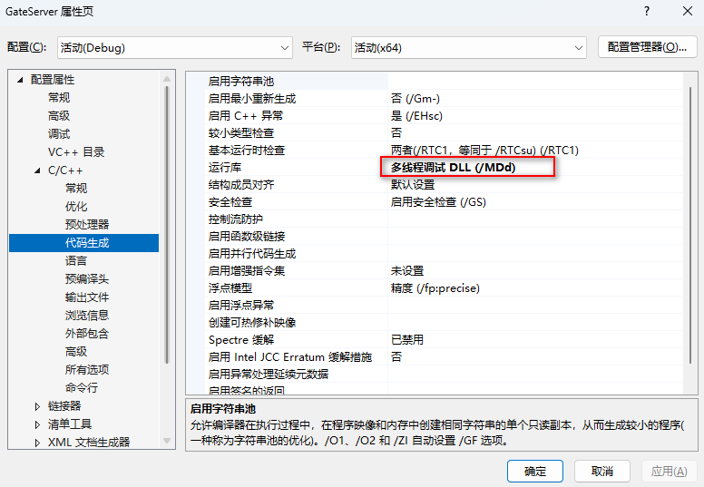
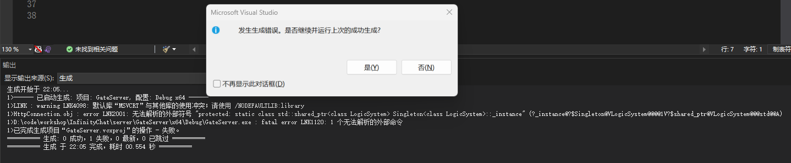

# 1. 单例模板类设计

> [恋恋风辰官方博客 (llfc.club)](https://llfc.club/category?catid=225RaiVNI8pFDD5L4m807g7ZwmF#!aid/2Us7GguoWj4KlSVEMlK0maTaDET)

## 1.1 CRTP技术

> CRTP（Curiously Recurring Template Pattern），中文称为“奇异递归模板模式”，是一种在 C++ 中使用模板实现静态多态性的技巧。这种模式使得派生类可以在编译时提供自己的特化行为，而不需要运行时的虚函数调用开销。CRTP 的典型实现形式是派生类将自身作为**模板参数传递给基类。**

```c++
#ifndef SINGLETON_H
#define SINGLETON_H

#include "global.h"

template <typename T>
class Singleton {
    //不允许外部对单例类机型构造，但是可以让子类去继承，所以这里使用protected
protected:
    Singleton() = default;
    Singleton(const Singleton<T>& ) = delete;
    Singleton& operator=(const Singleton<T>& ) = delete;
    //静态成员变量，所有使用该类的对象都返回同一个实例
    static std::shared_ptr<T> _instance;
public:
    static std::shared_ptr<T> GetInstance() {
        // once_flag只会被初始化一次
        static std::once_flag s_falg;
        //call_once 只有当s_falg为true时才会执行后面的函数
        std::call_once(s_falg, [&]() {
            // 继承模版单例类的子类的构造会设置为private，make_shared无法访问私有的构造函数
            //为什么不适用make_shared<T>(new T);？
//            _instance = std::make_shared<T>();
            /*
             * std::make_shared<T> 无法访问私有构造函数的原因是它在自己的上下文中调用构造函数，不受 friend 声明的影响。
             * std::shared_ptr<T>(new T) 可以在友元或成员函数中直接调用，因为此时上下文允许访问私有构造函数
             * 即make_shared<T>是在其实现内部调用T的构造函数，不是在Singleton<T>的上下文中调用的。
             * 因此无法构造，子类中的友元类声明是针对Singleton<T>的上下文。
            */
            _instance = std::shared_ptr<T>(new T);
        });
        return _instance;
    }

    void PrintAddress() {
        std::cout << _instance.get() << std::endl;
    }
    ~Singleton() {
        std::cout << "this is singleton destruct.\n";
    }
private:

};

template <typename T>
std::shared_ptr<T> Singleton<T>::_instance = nullptr;


#endif // SINGLETON_H

```

**案例**

```c++
#ifndef HTTPMGR_H
#define HTTPMGR_H

#include "singleton.h"
#include <QString>
#include <QUrl>
#include <QObject>
#include <QNetworkAccessManager>
#include <QJsonObject>
#include <QJsonDocument>

/*
 * CRTP（Curiously Recurring Template Pattern），中文称为“奇异递归模板模式”，
 * 是一种在 C++ 中使用模板实现静态多态性的技巧。
 * 这种模式使得派生类可以在编译时提供自己的特化行为，而不需要运行时的虚函数调用开销。
 * CRTP 的典型实现形式是派生类将自身作为模板参数传递给基类。
*/

class HttpMgr : public QObject, public Singleton<HttpMgr>,
        public std::enable_shared_from_this<HttpMgr>
{
    Q_OBJECT
public:
    ~HttpMgr();
    void PostHttpReq(QUrl url, QJsonObject json, ReqId req_id, Modules mod);

private:
    friend class Singleton<HttpMgr>;
    HttpMgr();


private:
    QNetworkAccessManager _manager;

private slots:
    void slot_http_finish(ReqId id, QString res, ErrorCodes err, Modules mod);

signals:
    void sig_http_finish(ReqId id, QString res, ErrorCodes err, Modules mod);
    void sig_reg_mod_finish(ReqId id, QString res, ErrorCodes err);
};

#endif // HTTPMGR_H

```


### 问题 1. 为什么std::make_shared\<T\>() 方法，如果构造函数是私有的，它将无法访问。而使用 访问私有构造函数的情况下，使用 std::shared_ptr\<T\>(new T) 可以访问

这是一个关于 C++ 访问控制和模板友元关系的关键点。要理解为什么 `std::make_shared<T>()` 无法访问私有构造函数，而 `std::shared_ptr<T>(new T)` 可以访问，需要了解模板的友元机制和如何访问私有成员。

#### 访问控制和友元机制

1. **私有构造函数的访问**：
   - 如果一个类的构造函数是私有的，那么只有该类的友元函数、友元类或者该类的成员函数可以访问这个构造函数。

2. **模板和友元**：
   - 当一个模板类声明另一个类为其友元时，它只允许这个模板实例化后的特定类型访问其私有成员。

#### `std::make_shared<T>` 和 `std::shared_ptr<T>(new T)` 的区别

- **`std::make_shared<T>`**：
  - `std::make_shared<T>` 是一个模板函数，在内部它会调用 `new T()` 来创建一个对象。
  - 如果 `T` 的构造函数是私有的，`std::make_shared<T>` 无法直接访问这个私有构造函数，因为它不是 `T` 的友元。

- **`std::shared_ptr<T>(new T)`**：
  - `std::shared_ptr<T>(new T)` 只是普通的 `new` 运算符，它是在类的友元或者成员函数内部直接调用的。
  - 如果这个调用发生在可以访问 `T` 的私有构造函数的上下文中（例如在一个友元类中），则它可以正常工作。

#### 示例和解释

#### 不使用 `std::make_shared<T>`

```cpp
template <typename T>
class Singleton {
protected:
    Singleton() = default;
    Singleton(const Singleton<T>&) = delete;
    Singleton& operator=(const Singleton<T>&) = delete;

    static std::shared_ptr<T> _instance;

public:
    static std::shared_ptr<T> GetInstance() {
        static std::once_flag s_flag;
        std::call_once(s_flag, []() {
            _instance = std::shared_ptr<T>(new T);  // 访问私有构造函数
        });
        return _instance;
    }
};

template <typename T>
std::shared_ptr<T> Singleton<T>::_instance = nullptr;

class MyClass : public Singleton<MyClass> {
    friend class Singleton<MyClass>;  // 允许 Singleton<MyClass> 访问私有构造函数
private:
    MyClass() {
        std::cout << "MyClass instance created.\n";
    }
};

int main() {
    auto instance1 = MyClass::GetInstance();
    instance1->PrintAddress();

    auto instance2 = MyClass::GetInstance();
    instance2->PrintAddress();

    return 0;
}
```

在上面的代码中，`Singleton<MyClass>` 是 `MyClass` 的友元类，因此它可以访问 `MyClass` 的私有构造函数。`std::shared_ptr<T>(new T)` 调用发生在 `Singleton<MyClass>` 内部，所以它可以创建 `MyClass` 的实例。

#### 使用 `std::make_shared<T>`

```cpp
template <typename T>
class Singleton {
protected:
    Singleton() = default;
    Singleton(const Singleton<T>&) = delete;
    Singleton& operator=(const Singleton<T>&) = delete;

    static std::shared_ptr<T> _instance;

public:
    static std::shared_ptr<T> GetInstance() {
        static std::once_flag s_flag;
        std::call_once(s_flag, []() {
            _instance = std::make_shared<T>();  // 无法访问私有构造函数
        });
        return _instance;
    }
};

template <typename T>
std::shared_ptr<T> Singleton<T>::_instance = nullptr;

class MyClass : public Singleton<MyClass> {
    friend class Singleton<MyClass>;  // 允许 Singleton<MyClass> 访问私有构造函数
private:
    MyClass() {
        std::cout << "MyClass instance created.\n";
    }
};

int main() {
    auto instance1 = MyClass::GetInstance();
    instance1->PrintAddress();

    auto instance2 = MyClass::GetInstance();
    instance2->PrintAddress();

    return 0;
}
```

在这个代码中，`std::make_shared<T>` 无法访问 `MyClass` 的私有构造函数，即使 `Singleton<MyClass>` 是友元。这是因为 `std::make_shared<T>` 在其实现内部调用 `T` 的构造函数，而不是在 `Singleton<MyClass>` 的上下文中调用。

#### 结论

- `std::make_shared<T>` 无法访问私有构造函数的原因是它在自己的上下文中调用构造函数，不受 `friend` 声明的影响。
- `std::shared_ptr<T>(new T)` 可以在友元或成员函数中直接调用，因为此时上下文允许访问私有构造函数。

因此，当需要访问私有构造函数时，应避免使用 `std::make_shared<T>`，可以使用 `std::shared_ptr<T>(new T)`，前提是调用发生在可以访问私有构造函数的上下文中。

### 问题2 std::make_shared\<T\>和std::shared_ptr\<T\>(new T) 的区别

`std::make_shared<T>` 和 `std::shared_ptr<T>(new T)` 都是用于创建 `std::shared_ptr` 的方法，但它们在性能、安全性和内存管理方面有一些显著的区别。

#### `std::make_shared<T>`

```cpp
auto ptr = std::make_shared<T>();
```

**优点**：

1. **内存分配更高效**：
   - `std::make_shared` 只进行一次内存分配，分配的内存包含了对象和控制块（用于引用计数）。
   - 这种方式在分配和释放内存时都更加高效。

2. **异常安全**：
   - `std::make_shared` 可以防止在内存分配和对象构造之间出现异常导致的内存泄漏。
   - 它保证对象的构造和控制块的创建是原子操作。

3. **简洁性**：
   - 使用 `std::make_shared` 语法更简洁，更具可读性。

**缺点**：

- 如果对象的构造函数是私有的，`std::make_shared` 无法直接使用，因为它不能访问私有构造函数。

#### `std::shared_ptr<T>(new T)`

```cpp
auto ptr = std::shared_ptr<T>(new T());
```

**优点**：

1. **灵活性**：
   - 可以用于对象的构造函数是私有的情况，只要调用发生在可以访问私有构造函数的上下文中（如友元类）。
   - 允许使用自定义删除器，这在需要精细控制对象生命周期时非常有用。

**缺点**：

1. **内存分配效率较低**：
   - 这种方式需要进行两次内存分配：一次用于对象本身，另一次用于控制块（引用计数）。
   - 两次内存分配意味着更多的内存碎片和较低的缓存局部性。

2. **异常安全性较差**：
   - 如果在 `new T` 之后但在 `std::shared_ptr` 构造之前抛出异常，将导致内存泄漏。

#### 内存使用对比

- `std::make_shared<T>`：在单次内存分配中分配对象和控制块。
- `std::shared_ptr<T>(new T)`：两次独立的内存分配，一次用于对象，一次用于控制块。

#### 示例代码比较

```cpp
#include <iostream>
#include <memory>

// 使用 std::make_shared<T>
void useMakeShared() {
    auto ptr = std::make_shared<int>(42);
    std::cout << "Value: " << *ptr << std::endl;
}

// 使用 std::shared_ptr<T>(new T)
void useSharedPtr() {
    auto ptr = std::shared_ptr<int>(new int(42));
    std::cout << "Value: " << *ptr << std::endl;
}

int main() {
    useMakeShared();
    useSharedPtr();
    return 0;
}
```

#### 何时使用哪种方法

- **优先使用 `std::make_shared<T>`**：大多数情况下，应优先使用 `std::make_shared<T>`，因为它更高效且异常安全。
- **使用 `std::shared_ptr<T>(new T)`**：如果需要访问私有构造函数，或者需要使用自定义删除器时，可以使用这种方法。

#### 结论

`std::make_shared<T>` 是一种更现代、更高效的创建 `std::shared_ptr` 的方法，通常应优先使用。而 `std::shared_ptr<T>(new T)` 提供了更大的灵活性，但在内存管理和异常安全性方面稍有不足。根据具体需求选择适当的方法可以确保代码既高效又安全。

## 1.2 局部静态单例类

> [CPlusPlusThings/design_pattern/singleton at master · Light-City/CPlusPlusThings (github.com)](https://github.com/Light-City/CPlusPlusThings/tree/master/design_pattern/singleton)

Scott Meyer在《Effective C++》中提出了一种简洁的singleton写法

```cpp
singleton &singleton::instance() {
    static singleton p;
    return p;
}
```

- 单线程下，正确。
- C++11及以后的版本（如C++14）的多线程下，正确。
- C++11之前的多线程下，不一定正确。

原因在于在C++11之前的标准中并没有规定local static变量的内存模型。于是乎它就是不是线程安全的了。但是在C++11却是线程安全的，这是因为新的C++标准规定了当一个线程正在初始化一个变量的时候，其他线程必须得等到该初始化完成以后才能访问它。

上述使用的内存序：

- memory_order_relaxed：松散内存序，只用来保证对原子对象的操作是原子的
- memory_order_acquire：获得操作，在读取某原子对象时，当前线程的任何后面的读写操作都不允许重排到这个操作的前面去，并且其他线程在对同一个原子对象释放之前的所有内存写入都在当前线程可见
- memory_order_release：释放操作，在写入某原子对象时，当前线程的任何前面的读写操作都不允许重排到这个操作的后面去，并且当前线程的所有内存写入都在对同一个原子对象进行获取的其他线程可见


# 2. `enable_shared_from_this`模板类

`shared_from_this()` 是 C++11 引入的一种机制，用于安全地从类的成员函数中创建指向当前对象的 `std::shared_ptr`。这是通过 `std::enable_shared_from_this` 基类实现的。其主要作用是确保当你需要从对象内部创建一个共享智能指针时，不会发生多次创建共享计数器，从而避免了对象的生命周期管理问题。

### 使用原因

1. **避免重复管理生命周期**：
   `shared_from_this()` 能保证当你在类内部需要一个指向自身的 `std::shared_ptr` 时，不会创建新的控制块，而是与外部已经存在的 `std::shared_ptr` 共享控制块，确保引用计数的一致性。

2. **安全性**：
   直接在类内部创建 `std::shared_ptr` 指向自身可能会导致重复管理生命周期的问题。而 `shared_from_this()` 确保了对象的安全管理，避免了重复删除或悬空指针等问题。

3. **便捷性**：
   在需要在类内部传递自身作为 `std::shared_ptr` 时（例如回调函数、异步操作等场景），使用 `shared_from_this()` 非常便捷。

### 典型场景

1. **回调函数**：
   在异步操作或回调中，需要传递 `std::shared_ptr` 管理的对象自身，以确保对象在操作期间不会被销毁。

2. **工厂模式**：
   在工厂方法中，需要返回 `std::shared_ptr` 指向新创建的对象，可以通过 `shared_from_this()` 来确保对象生命周期的安全管理。

### 示例代码

下面是一个使用 `shared_from_this()` 的简单示例：

```cpp
#include <iostream>
#include <memory>

class MyClass : public std::enable_shared_from_this<MyClass> {
public:
    void print() {
        std::cout << "MyClass instance" << std::endl;
    }

    std::shared_ptr<MyClass> getPtr() {
        // 通过 shared_from_this() 返回一个 shared_ptr 指向当前对象
        return shared_from_this();
    }
};

void someFunction(std::shared_ptr<MyClass> ptr) {
    ptr->print();
}

int main() {
    // 创建一个 shared_ptr 管理的 MyClass 实例
    std::shared_ptr<MyClass> myClassPtr = std::make_shared<MyClass>();

    // 通过成员函数获取 shared_ptr
    std::shared_ptr<MyClass> anotherPtr = myClassPtr->getPtr();

    // 调用函数并传递 shared_ptr
    someFunction(anotherPtr);

    return 0;
}
```

### 详细解释

1. **继承 `std::enable_shared_from_this<MyClass>`**：
   `MyClass` 继承自 `std::enable_shared_from_this<MyClass>`，使得 `MyClass` 具有 `shared_from_this()` 方法。

2. **创建 `shared_ptr` 实例**：
   在 `main` 函数中，通过 `std::make_shared<MyClass>()` 创建了一个 `std::shared_ptr`，管理一个 `MyClass` 实例。

3. **获取 `shared_ptr`**：
   调用 `myClassPtr->getPtr()`，此时返回的是指向同一对象的 `std::shared_ptr`，且共享控制块，确保了引用计数的一致性。

4. **传递 `shared_ptr`**：
   将 `anotherPtr` 传递给 `someFunction`，函数内部可以安全地使用这个指针。

通过这种方式，`shared_from_this()` 确保了在需要从对象内部获取共享指针时的安全性和一致性，避免了多次创建控制块和引用计数管理混乱的问题。


## 为什么不适用this指针返回

直接返回 `this` 指针在很多情况下是不可取的，特别是在使用 `std::shared_ptr` 管理对象生命周期时。这是因为直接返回 `this` 指针无法保证对象的生命周期管理，而 `shared_from_this()` 可以确保对象生命周期的安全管理。

### 直接返回 `this` 指针的问题

1. **无法管理引用计数**：
   如果直接返回 `this` 指针，外部代码可能会创建新的 `std::shared_ptr` 指向该对象。这会导致两个独立的 `std::shared_ptr` 各自管理一个引用计数控制块，从而在对象被销毁时可能出现多次释放的问题。

2. **生命周期管理问题**：
   直接返回 `this` 指针时，无法保证对象在使用期间不会被销毁。例如，如果对象在其他地方已经被销毁，那么通过返回的裸指针访问对象会导致未定义行为。

3. **不一致的引用计数**：
   如果对象已经由一个 `std::shared_ptr` 管理，那么直接返回 `this` 指针会导致引用计数不一致。`shared_from_this()` 确保返回的 `std::shared_ptr` 与原有的 `std::shared_ptr` 共享同一个引用计数控制块。

### 示例对比

下面是直接返回 `this` 指针和使用 `shared_from_this()` 的对比示例：

#### 直接返回 `this` 指针（不推荐）

```cpp
#include <iostream>
#include <memory>

class MyClass {
public:
    void print() {
        std::cout << "MyClass instance" << std::endl;
    }

    MyClass* getPtr() {
        return this;
    }
};

int main() {
    // 创建一个 shared_ptr 管理的 MyClass 实例
    std::shared_ptr<MyClass> myClassPtr = std::make_shared<MyClass>();

    // 获取裸指针
    MyClass* rawPtr = myClassPtr->getPtr();

    // 尝试创建新的 shared_ptr
    std::shared_ptr<MyClass> newPtr(rawPtr); // 可能导致多个 shared_ptr 管理同一对象

    myClassPtr->print();
    newPtr->print();

    return 0;
}
```

这种方式会导致两个 `std::shared_ptr`（`myClassPtr` 和 `newPtr`）各自独立管理一个引用计数控制块，可能导致多次释放 `MyClass` 对象。

#### 使用 `shared_from_this()`（推荐）

```cpp
#include <iostream>
#include <memory>

class MyClass : public std::enable_shared_from_this<MyClass> {
public:
    void print() {
        std::cout << "MyClass instance" << std::endl;
    }

    std::shared_ptr<MyClass> getPtr() {
        return shared_from_this();
    }
};

void someFunction(std::shared_ptr<MyClass> ptr) {
    ptr->print();
}

int main() {
    // 创建一个 shared_ptr 管理的 MyClass 实例
    std::shared_ptr<MyClass> myClassPtr = std::make_shared<MyClass>();

    // 通过成员函数获取 shared_ptr
    std::shared_ptr<MyClass> anotherPtr = myClassPtr->getPtr();

    // 调用函数并传递 shared_ptr
    someFunction(anotherPtr);

    return 0;
}
```

通过这种方式，`shared_from_this()` 返回的 `std::shared_ptr` 与原有的 `myClassPtr` 共享同一个引用计数控制块，确保了对象生命周期的安全管理。

### 结论

虽然直接返回 `this` 指针在某些情况下可以工作，但在涉及对象生命周期管理和引用计数时，使用 `shared_from_this()` 更为安全和可靠。它能确保多个 `std::shared_ptr` 共享同一个引用计数控制块，避免多次释放对象以及生命周期管理问题。

###  使用 `std::make_shared<T>` 和 `std::shared_ptr<T>(new T)` 的区别

**区别**：

- `std::make_shared<T>`：这个函数是 C++11 中引入的，用于创建一个 `std::shared_ptr` 对象。它一次性分配内存，用于存储对象和控制块（引用计数）。这种方法更高效，且异常安全，因为它确保在分配内存时发生异常时不会导致内存泄漏。

- `std::shared_ptr<T>(new T)`：这种方法首先分配对象的内存，然后创建一个独立的控制块。由于分配对象和控制块的操作是分开的，所以在异常安全性和内存使用上不如 `std::make_shared`。

**推荐使用**：

`std::make_shared<T>` 通常是更好的选择，因为它更高效且异常安全。

**示例**：

```cpp
// 推荐的方式
_instance = std::make_shared<T>();

// 不推荐的方式
_instance = std::shared_ptr<T>(new T);
```

**总结**：

- `std::make_shared<T>` 更高效，分配一次内存，适合大多数情况。
- `std::shared_ptr<T>(new T)` 分配两次内存，适合需要自定义删除器或某些特定情况。

### 2. 在 `MyClass` 中不声明 `friend class Singleton<MyClass>;` 是否可行

**问题分析**：

`friend class Singleton<MyClass>;` 声明允许 `Singleton<MyClass>` 访问 `MyClass` 的私有构造函数。如果不声明友元类，那么 `Singleton<MyClass>` 无法访问 `MyClass` 的私有构造函数，无法创建其实例。

**示例**：

如果不声明友元类，代码将无法编译：

```cpp
class MyClass : public Singleton<MyClass> {
private:
    MyClass() {
        std::cout << "MyClass instance created.\n";
    }
};

int main() {
    auto instance1 = MyClass::GetInstance();  // 编译错误
    instance1->PrintAddress();

    return 0;
}
```

编译时将会出现类似以下的错误：

```
error: ‘MyClass::MyClass()’ is private within this context
```

**解决方案**：

确保 `Singleton<MyClass>` 能够访问 `MyClass` 的私有构造函数，通过友元声明实现：

```cpp
class MyClass : public Singleton<MyClass> {
    friend class Singleton<MyClass>;  // 允许 Singleton<MyClass> 访问私有构造函数
private:
    MyClass() {
        std::cout << "MyClass instance created.\n";
    }
};
```

**总结**：

- 需要 `friend class Singleton<MyClass>;` 声明来允许 `Singleton<MyClass>` 访问 `MyClass` 的私有构造函数，否则无法实例化对象。
- 友元声明确保 `Singleton` 模板类能正确创建子类的单例实例。

### 最终代码

结合上述解释，最终的代码应如下：

```cpp
#include <iostream>
#include <memory>
#include <mutex>

// Singleton 模板类定义
template <typename T>
class Singleton {
protected:
    Singleton() = default;
    Singleton(const Singleton<T>&) = delete;
    Singleton& operator=(const Singleton<T>&) = delete;

    static std::shared_ptr<T> _instance;

public:
    static std::shared_ptr<T> GetInstance() {
        static std::once_flag s_flag;
        std::call_once(s_flag, []() {
            // 使用 make_shared 创建实例
            _instance = std::make_shared<T>();
        });
        return _instance;
    }

    void PrintAddress() {
        std::cout << _instance.get() << std::endl;
    }

    ~Singleton() {
        std::cout << "This is singleton destruct.\n";
    }
};

template <typename T>
std::shared_ptr<T> Singleton<T>::_instance = nullptr;

// 示例子类
class MyClass : public Singleton<MyClass> {
    friend class Singleton<MyClass>;  // 允许 Singleton<MyClass> 访问私有构造函数
private:
    MyClass() {
        std::cout << "MyClass instance created.\n";
    }
};

int main() {
    auto instance1 = MyClass::GetInstance();
    instance1->PrintAddress();

    auto instance2 = MyClass::GetInstance();
    instance2->PrintAddress();

    return 0;
}
```

这样，代码既高效、安全，又能正确地实现单例模式。


## 使用时应该注意的问题

### _Throw_bad_weak_ptr原因

> 在使用`shared_from_this`()函数时，会抛出`_Throw_bad_weak_ptr`错误

**问题原因：**

创建类A的对象的时候**没有用智能指针包裹**，而是直接new的裸指针


**`shared_from_this`原理**

shared_from_this()是enable_shared_from_this<T>的成员函数，返回shared_ptr<T>;
注意的是，这个函数仅在shared_ptr<T>的构造函数被调用之后才能使用。
原因是enable_shared_from_this::weak_ptr并不在构造函数中设置，而是在shared_ptr<T>的构造函数中设置。

```c++
//CServer server(ioc, port);
// 对应继承了enbale_shared_from_this<>的类，构造对象时，需要使用只能指针的形式构造，
// 而不能使用裸指针或直接在栈上构造，否则会抛出`_Throw_bad_weak_ptr`错误
auto server = std::make_shared<CServer>(ioc, port);
//std::make_shared<CServer>(ioc, port);
server->Start();
ioc.run();
```


# 3. LINK : warning LNK4098: 默认库“MSVCRT”与其他库的使用冲突；请使用 /NODEFAULTLIB:library

项目属性中，查看--代码生成--运行库，使用到的库，和创建的项目，这个设置需要统一，由于boost是使用MDd编译的，故引用boost的项目也需要是MDd的。




# 4. 静态成员变量

> 静态成员变量需要在类外定义并初始化。

`Sinleton`类中的`_instance`变量就是如此，如果忘记类外定义则会抛出异常

```c++
# Singleton.h文件
// 静态成员变量需要类外初始化
template<typename T>
std::shared_ptr<T> Singleton<T>::_instance = nullptr;
```

**没用类外初始化的情况**




在 C++ 中，静态成员变量是属于类本身而不是某个特定对象的变量。静态成员变量在类的所有实例之间共享，并且需要在类外部进行定义和初始化。下面是如何初始化静态成员变量的详细说明和示例。

### 定义和初始化静态成员变量

#### 1. 在类声明中声明静态成员变量

在类声明中声明静态成员变量，但不要在这里初始化它。

```cpp
class MyClass {
public:
    static int staticVar; // 声明静态成员变量
};
```

#### 2. 在类外部定义和初始化静态成员变量

在类的实现文件（通常是 `.cpp` 文件）中定义并初始化静态成员变量。

```cpp
#include "MyClass.h" // 包含类的头文件

int MyClass::staticVar = 10; // 定义并初始化静态成员变量
```

### 示例代码

以下是一个完整的示例，展示了如何在类中声明、定义和初始化静态成员变量。

#### MyClass.h

```cpp
#ifndef MYCLASS_H
#define MYCLASS_H

class MyClass {
public:
    static int staticVar; // 声明静态成员变量

    // 一个方法，用于演示访问静态成员变量
    static void printStaticVar();
};

#endif // MYCLASS_H
```

#### MyClass.cpp

```cpp
#include "MyClass.h"
#include <iostream>

// 定义并初始化静态成员变量
int MyClass::staticVar = 10;

// 静态成员函数，用于演示访问静态成员变量
void MyClass::printStaticVar() {
    std::cout << "staticVar: " << staticVar << std::endl;
}
```

#### main.cpp

```cpp
#include "MyClass.h"
#include <iostream>

int main() {
    // 访问并打印静态成员变量
    std::cout << "Initial value: " << MyClass::staticVar << std::endl;

    // 修改静态成员变量的值
    MyClass::staticVar = 20;

    // 再次访问并打印静态成员变量
    MyClass::printStaticVar();

    return 0;
}
```

### 解释

1. **声明静态成员变量**：
    - 在 `MyClass` 类中声明静态成员变量 `staticVar`。

2. **定义并初始化静态成员变量**：
    - 在 `MyClass.cpp` 文件中，定义并初始化 `staticVar`。这一步是必不可少的，否则会导致链接错误。

3. **访问静态成员变量**：
    - 静态成员变量可以通过类名直接访问（如 `MyClass::staticVar`），也可以通过类的静态成员函数访问。

### 特殊情况

#### 1. 非整型静态成员变量

对于非整型的静态成员变量，通常在类外部定义并初始化，但不能在类内直接初始化。

```cpp
class MyClass {
public:
    static std::string staticStr;
};

std::string MyClass::staticStr = "Hello, World!";
```

#### 2. 常量静态成员变量

对于常量静态成员变量（`const`），可以在类内初始化（如果是整型或枚举类型），也可以在类外部初始化。

```cpp
class MyClass {
public:
    static const int staticConstVar = 10; // 在类内初始化（整型常量）
};

// 如果是其他类型，需要在类外部初始化
const std::string MyClass::staticConstStr = "Hello, World!";
```

总结起来，静态成员变量需要在类外部定义和初始化，以确保在所有实例之间共享，并且遵循 C++ 的链接规则。